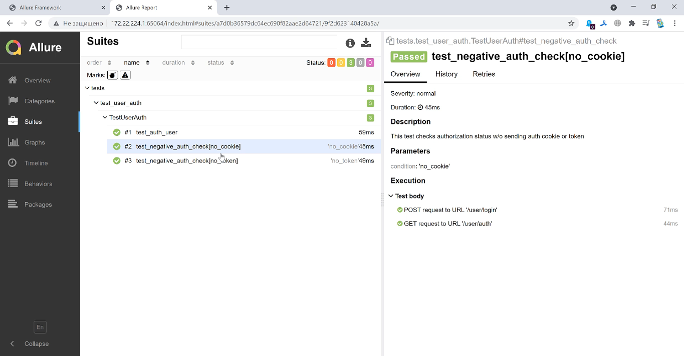

<table width="100%" border='0'>
 <tr><td width="30%" valign="bottom"></td><td valign="middle">
 <h2>Демо проект по автоматизации тестирования API  <a target="_blank" href="https://playground.learnqa.ru/api/map"> playground.learnqa.ru/api<a></h2>
 </td></tr>
</table>

<h3>Проект создан в рамках обучения на курсе <a target="_blank" href="https://www.learnqa.ru/python_api"> Автоматизация тестирования REST API на Python.</a></h3>

## :open_book: Содержание:
- [Описание проекта](#heavy_check_mark-описание)
- [Технологии и инструменты](#gear-технологии-и-инструменты)
- [Реализованные проверки](#ballot_box_with_check-реализованные-проверки)
- [Как запускать тесты](#on-как-запускать-тесты)
- [Allure отчет](#bar_chart-allure-отчет-о-прохождении-тестов)
  
## :heavy_check_mark: Описание:
>В этом репозитории:
>- Демо-проект с примерами автотестов API, написанных на языке <code>Python</code> с помощью библиотеки <code>Requests</code>.
>- Ссылка на API <a target="_blank" href="https://playground.learnqa.ru/api/map"> https://playground.learnqa.ru/api/map/api<a>
>- Тесты запускаются в Docker контейнере.
>- Пайплайн 
>- Формируется

## :gear: Технологии и инструменты:
<div align="center">
  &nbsp;
  &nbsp;
  &nbsp;
  &nbsp;
  &nbsp;
  &nbsp;
  &nbsp;
  &nbsp;
</div>

## :ballot_box_with_check: Реализованные проверки:
- [x] Сценарий покупки товара "Sauce Labs Backpack"
- [x] Сценарий покупки товара Sauce Labs Bike Light
- [x] Проверка перехода в пункт меню About
- [x] Заведомо падающий тест (для красивого отчета)
- [x] Пропущенный тест (для красивого отчета)

## :on: Как запускать тесты:

>1. Перейти во вкладку `Actions`
>2. В левом меню выбрать воркфлоу `Saucedemo UI tests`
>3. Выбрать в выпадающем списке какие тесты будут запускаться
>   - `All tests` - будут запущены все тесты
>   - `Buy tests` - будут запущены тесты покупки товаров
>4. Нажать **Run workflow**
>5. Дождаться завершения пайплайна и можно смотреть отчет о пройденных тестах


## :bar_chart: Allure отчет о прохождении тестов

> для формирования отчета ввести в командной строке: 
```bash
allure serve .\allure-results
```

*Главная страница Allure-отчета содержит следующие информационные блоки:*

> - [x] <code><strong>*ALLURE REPORT*</strong></code> - отображается дату и время прохождения теста, общее количество тест кейсов, а также диаграмма с указанием процента и количества успешных, упавших и сломавшихся в процессе выполнения тестов
>- [x] <code><strong>*TREND*</strong></code> - отображает тренд прохождения тестов от сборки к сборке
>- [x] <code><strong>*SUITES*</strong></code> - отображает распределение результатов тестов по тестовым наборам
>- [x] <code><strong>*CATEGORIES*</strong></code> - отображает распределение неуспешно прошедших тестов по видам дефектов
>- [x] <code><strong>*ENVIRONMENT*</strong></code> - отображает тестовое окружение, на котором запускались тесты 
>- [x] <code><strong>*FEATURES BY STORIES*</strong></code> - отображает распределение тестов по функционалу, который они проверяют

###### Пример отчета

